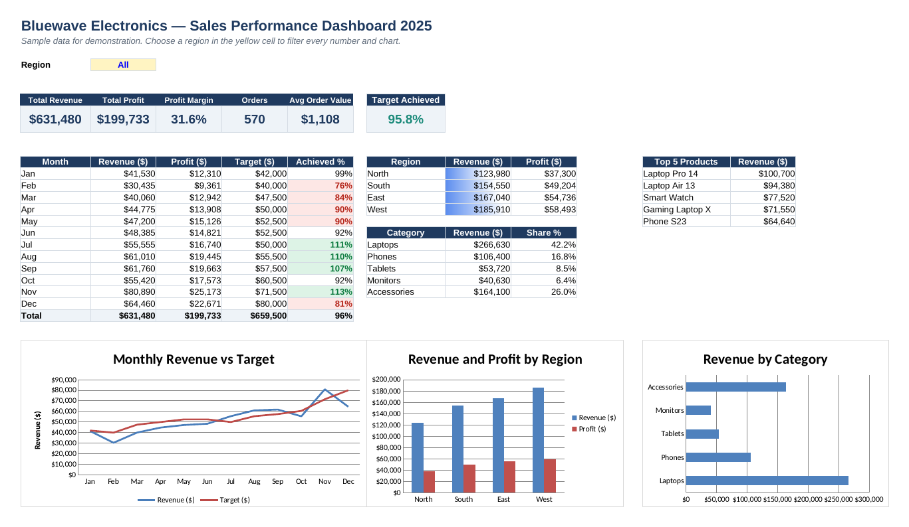

# Excel Sales Performance Dashboard

An interactive Excel dashboard for a fictional electronics retailer, **Bluewave Electronics**. It shows advanced formulas, a filterable dashboard, charts, VBA automation and Power Query data cleaning. All names and data are made up for demonstration.

## What's inside

| File | What it is |
|---|---|
| `Sales-Performance-Dashboard.xlsx` | The workbook: Read Me, Dashboard, Sales Data (570 orders), Products, Targets, Calc |
| `SalesDashboardMacros.bas` | VBA module: refresh, export dashboard to PDF (one region or all regions), add a new order row, reset filter |
| `CleanSalesData.m` | Power Query script that imports and cleans a raw CSV export |
| `sample_raw_sales.csv` | A messy CSV (extra spaces, wrong capitals, duplicate, bad date, zero units, missing ID) to test the Power Query |
| `dashboard.png` | Screenshot of the dashboard |

## Skills shown

- **Lookups:** INDEX/MATCH from a product master table (price, cost, category)
- **Conditional totals:** SUMIFS and SUMPRODUCT
- **Interactive filter:** a region drop-down (data validation) that updates every KPI, table and chart
- **KPIs:** revenue, profit, margin, orders, average order value, target achieved
- **Target vs actual** with conditional formatting (green above target, red below 90%)
- **Top 5 products** ranking with LARGE + INDEX/MATCH and a tie-safe helper column
- **Charts** linked to live formulas: monthly revenue vs target, revenue and profit by region, revenue by category
- **Data bars**, frozen headers, auto-filter, print-ready landscape layout
- **VBA** automation and **Power Query** data cleaning

## How to use

1. Open `Sales-Performance-Dashboard.xlsx` and go to **Dashboard**.
2. Pick a region in the yellow cell (C5).
3. Change inputs (blue numbers) in **Products** or **Targets** and watch everything update.

### Add the macros

1. File → Save As → **Excel Macro-Enabled Workbook (.xlsm)**
2. Press **Alt + F11** → File → Import File → `SalesDashboardMacros.bas`
3. Insert → Shapes → draw a button on the Dashboard → right-click → Assign Macro

### Add the Power Query

1. Data → Get Data → From Other Sources → **Blank Query**
2. Home → **Advanced Editor** → paste `CleanSalesData.m`
3. Change `SourcePath` to where you saved `sample_raw_sales.csv` → Done → **Close & Load**

The 29 messy rows become 25 clean, typed, de-duplicated orders.
